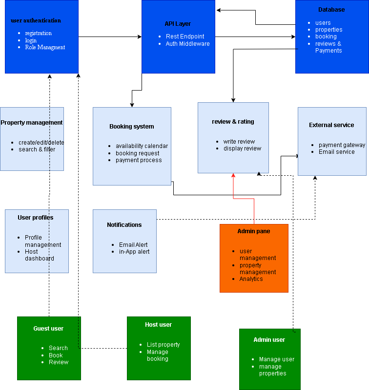

# 🏡 Airbnb Clone Backend - Features and Functionalities

This document outlines the key features and backend components of the Airbnb Clone project, as part of the ALX ProBackend program. The architecture supports secure user interactions, property listings, bookings, and admin control, as illustrated in the project diagram.

---

## 📌 Project Objective

To design and document a robust backend for the Airbnb Clone, including user roles, core features, and external integrations, with clear separation of concerns across all layers.

---

## 🧱 Core Components & Functionalities

### 🔐 1. User Authentication
- User Registration & Login
- Role Management (Guest, Host, Admin)

### 🌐 2. API Layer
- REST API Endpoints
- Authentication Middleware

### 🗃️ 3. Database
- Users
- Properties
- Bookings
- Reviews
- Payments

### 🏠 4. Property Management
- Create/Edit/Delete Properties
- Search & Filter Properties

### 📆 5. Booking System
- Availability Calendar
- Booking Request Handling
- Payment Process

### ✍️ 6. Reviews & Ratings
- Write Reviews
- Display Ratings

### 👤 7. User Profiles
- Profile Management
- Host Dashboard

### 🔔 8. Notifications
- Email Alerts
- In-App Alerts

### ⚙️ 9. Admin Panel
- User Management
- Property Management
- Analytics & Insights

### 🔌 10. External Services
- Payment Gateway Integration
- Email Services

---

## 👥 User Roles

### 🧑 Guest User
- Search Properties
- Book Listings
- Write Reviews

### 🏘️ Host User
- List Properties
- Manage Bookings
- Access Host Dashboard

### 🛠️ Admin User
- Manage Users
- Manage Properties
- Access Analytics Dashboard

---

## 🗂️ Visual Design

The architecture and features are visually represented in the system design diagram below:

📁 Diagram Path: `features-and-functionalities/Airbnb.drawio.png`

---

## ✅ Deliverables

- ✅ Documented features in this `README.md`
- ✅ PNG diagram created with Draw.io
- ✅ Diagram stored in `features-and-functionalities/` directory

---

## 🚀 Repository

This documentation is part of the `alx-airbnb-project-documentation` repository.

---

## 👨‍💻 Author

**Jeph** – ALX ProBackend Student | Aspiring Data Scientist & Backend Developer
